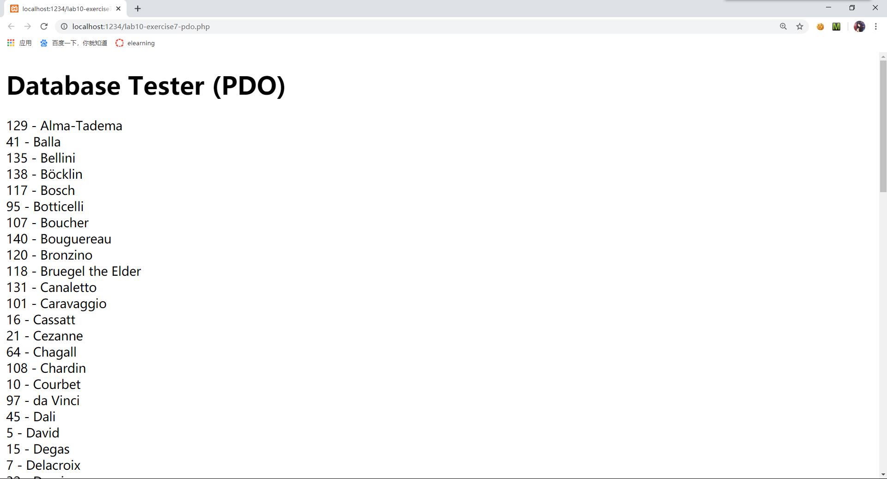
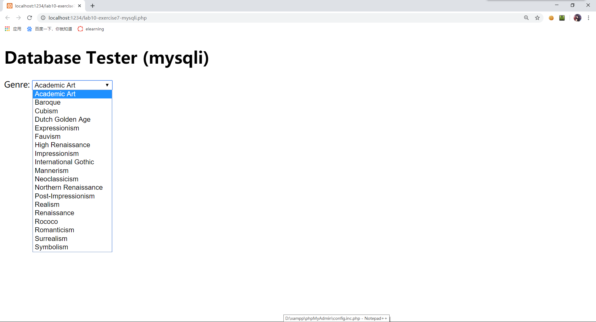
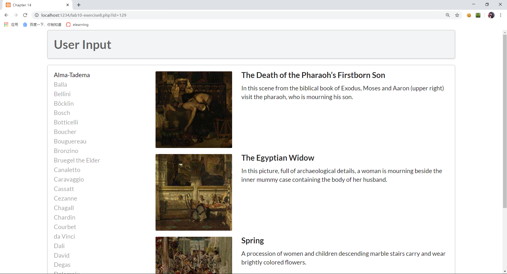

# lab10设计文档

19SS 张斐然 18307110244

## Exercise7


####1.使用PDO连接数据库

 

 `$pdo = new PDO(DBCONNSTRING,DBUSER,DBPASS);`语句创建了一个PDO对象，并根据config.php文件内的账户信息连接到了数据库。
 
 `$pdo->setAttribute(PDO::ATTR_ERRMODE, PDO::ERRMODE_EXCEPTION);`语句设置了该对象的错误模式。

 `$sql = "select * from Artists order by LastName";`语句设置了sql查询的字符串。

 ````
 $result = $pdo->query($sql);
 while ($row = $result->fetch()) {
    echo $row['ArtistID'] . " - " . $row['LastName'] . "<br/>";
 }
 ````
 代码进行了sql查询，并将结果输出在文档中。

####2.使用MySQLi连接数据库

 

 `$connection = mysqli_connect(DBHOST, DBUSER, DBPASS, DBNAME);`根据config.php文件内的账户信息到数据库。
 
 ````
 if(mysqli_connect_errno()){
    die(mysqli_connect_error());
 } 
 ````
 若连接失败，则执行die语句。
 
 `$sql = "select * from Genres order by GenreName";`语句设置了sql查询的字符串。
 
 
 ````
 if ($result = mysqli_query($connection, $sql)) {
    while($row = mysqli_fetch_assoc($result)) {
    echo '<option value="' . $row['GenreID'] . '">';
    echo $row['GenreName'];
    echo "</option>";
    }
    mysqli_free_result($result);
 }
 ````
 代码进行sql查询，并将结果数组进行循环输出，最后释放结果集。

 `mysqli_close($connection);`语句关闭了数据库的连接。
## Exercise8

 

####1.outputArtists函数

 ````
 $pdo = new PDO(DBCONNSTRING,DBUSER,DBPASS);
 $pdo->setAttribute(PDO::ATTR_ERRMODE, PDO::ERRMODE_EXCEPTION);
 $sql = "select * from Artists order by LastName limit 0,30";
 $result = $pdo->query($sql);
 ````
 代码通过PDO连接到了数据库，并进行了想要的查询，获得了结果集。

 ````
 while ($row = $result->fetch()) {
    echo '<a href="' . $_SERVER["SCRIPT_NAME"] . '?id=' . $row['ArtistID'] . '" class="';
    if (isset($_GET['id']) && $_GET['id'] == $row['ArtistID']) 
        echo 'active ';
    echo 'item">';
    echo $row['LastName'] . '</a>';
 }
 ````
 代码循环获得结果集中每一行的关联数组，并将其中数据以<a>标签的形式输出到文档中。
 
####2.outputPaintings函数

 `$sql = 'select * from Paintings where ArtistId=' . $_GET['id'];`查询对应ArtistId的Paintings信息并返回结果集。
 
####3.outputSinglePainting函数

 函数参数为$row，即数据表一行的关联数组。
 
 该函数输出了一个单独的Paintings信息。
 
 
## Exercise9

####1.执行SQL语句的几种方式

 ①`exec()`方法。如：`$res=$pdo->exec($query);`该方法返回受影响的行数。
 
 ②`query()`方法。如：`$res=$pdo->query($query);`该方法返回查询的结果集。
 
 ③使用预处理语句，即`prepare()`方法和`execute()`方法。
 
 `prepare()`方法进行了查询准备工作，如： `$res=$pdo->prepare($query);`
 
 `execute()`方法执行查询，如：`$res->execute();`
 
 `bindParam()`方法可以绑定参数给`execute()`方法，如：`$statement->bindValue(':id', $id); `

####2.使用预处理语句的好处

 ①效率较高。每条预处理语句都是预编译后的SQL语句，可以使用多次，每次只需将数据传至服务器。
 
 ②可以对使用占位符的数据进行安全处理，防止SQL注入攻击。


