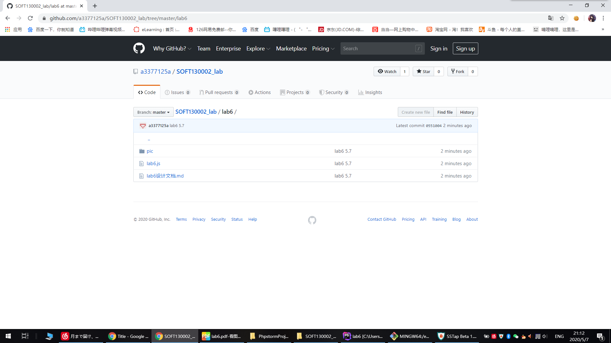
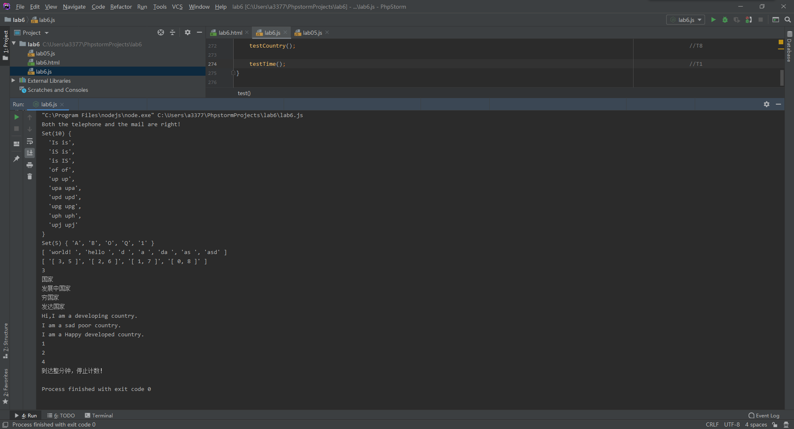

# lab6设计文档

19SS 张斐然 18307110244

## 各个正则表达式的解释

* *第二题中的正则表达式*

  `/^1[3456789]\d{9}$/`。
  
  验证手机号的正则表达式。`1`代表字符串的首位是1，[3456789]代表第二位是3456789中的一个，\d{9}代表之后是九位数字。
  
  `/^[a-zA-Z0-9][a-zA-Z0-9_-]*@[a-zA-Z0-9_-]+(\.[a-zA-Z0-9_-]+)+$/`
    
  验证邮箱的正则表达式。`[a-zA-Z0-9]`代表邮箱格式的首位是数字或字母，`[a-zA-Z0-9_-]*`代表接下来的几位（可以没有）
  由数字、字母、-、_、组成。之后是@字符，`[a-zA-Z0-9_-]+`为@字符后紧接着的字符串，`(\.[a-zA-Z0-9_-]+)+`代表邮箱
  可以有多个小数点。
  
* *第三题中的正则表达式*

  `/\b[a-z]+\b/ig`
  
  这是截取字符串中所有单词（不分大小写）的正则表达式。`\b`代表单词间隔的位置，取两个`\b`间的所有字母即可截取单词。
  
## 继承不同方式的理解

* 原型链继承重点是让新实例的原型等于父类的实例，从而继承父类的属性和方法。
  原型链继承中年，父类中私有的和公有的都继承到了子类原型上(子类公有的)。
         
  构造函数继承，即在子类构造函数的内部调用父类的构造函数。它避免了引用类型的属性被所有实例共享，
  但方法都在构造函数中定义，每次创建实例都会创建一遍方法。 
  
  `Object.create`方法可以接受一个对象作为参数，然后以它为原型，返回一个实例对象。该实例完全继承原型对象的属性。                     
  

## Map、Set、Array之间的区别和使用。

* Map，字典。这个数据结构储存键值对，即key-value。每一个key都是独一无二的，且只能对应一个value，存储过程中新值会替换旧值。
  它的特点是具有极快的查找速度。
  
  常用方法有`set(key, value)`向字典中添加新元素、`has(key)`如果键存在字典中返回true,否则false、
  `delete(key)`通过键值从字典中移除对应的数据。

* Set，集合。集合的元素是无序且唯一的，可以理解为没有顺序概念也没有重复元素的数组。常用于数据存储与数据去重。

  常用方法有`add(value)`向集合添加一个新的项、`delete(value)`从集合中移除一个值、
  `has(value)`如果值在集合中存在，返回true,否则false。
  
* Array，数组。它使用一个变量名顺序存储所有元素，并且可以用变量名访问任何一个值。相比于Map和Set，Array的特点是它是有序的。
  
* 由这次lab的题目中，我体会到了不同数据结构的优点与缺点。Set与Map在处理不能重复的、无序的数据，进行查找、去重时很方便，
  同时Map能够储存键值对。但Array在处理简单的线性数据时是效率最高的。
## 完成截图

